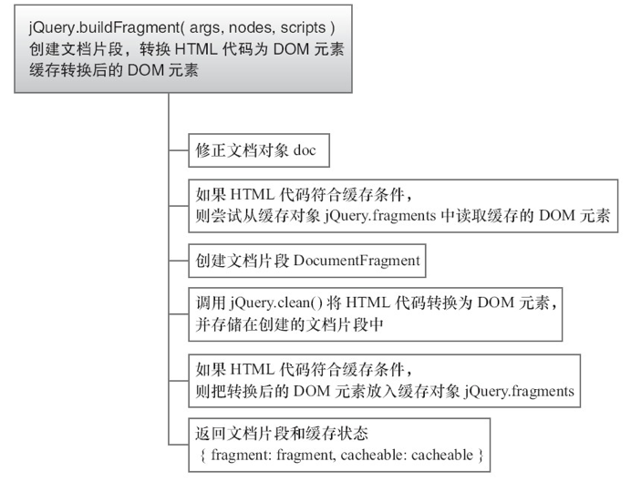

## 实现原理

方法 jQuery.builfFragment(args, nodes, scripts)先创建一个文档片段 DocumentFragment, 然后调用方法 jQuery.clean(elems, context, fragment, scripts)将 HTML 代码转换为 DOM 元素, 并存储在创建的文档片段中

文档片段 DocumentFragment 表示文档的一部分, 但不属于文档树. 当把 DocumentFragment 插入文档树时, 插入的不是 DocumentFragment 自身, 而是他的所有子孙节点, 即可以一次向文档树中插入多个节点. 当需要插入大量节点时, 相比逐个插入节点, 使用 ocumentFragment 一次插入多个节点, 性能的提升会非常明显

如果 HTML 代码符合缓存条件, 方法 jQuery.buildFragment()还会把转换后的 DOM 元素缓存起来, 下次转换相同的代码时, 直接从缓存中读取, 不需要重复转换

## 方法执行步骤

jQuery.buildFragment(args, nodes, scripts)执行步骤:

1. 如果 HTML 代码符合缓存条件, 则尝试从缓存对象 jQuery.fragments 中读取缓存的 DOM 元素
2. 创建文档片段 DocumentFragment
3. 调用方法 jQuery.clean(elems, context, Fragment, scripts) 将 HTML 代码转换为 DOM 元素, 并存储在创建的文档片段中
4. 如果 HTML 代码符合缓存条件,则把转换后的 DOM 元素防褥缓存对象 jQuery.Fragments
5. 最后返回文档片段和缓存状态 { fragment: fragment, cacheable: cacheable }

## jQuery.buildFragment() 方法源码

### 方法定义

```js
jQuery.buildFragment(args, nodes, scripts) {}
```

参数:

- ages: 数组, 含有待转换的 DOM 元素的 HTML 代码
- nodes: 数组, 含有文档对象、jQuery 对象或 DOM 元素, 用于修正创建文档片段 DocumentFragment 的文档对象
- scripts: 数组, 用于存放 HTML 代码中的 script 元素. 方法 jQuery.Fragment() 会把该参数传给方法 jQuery.clean(), 后者把 HTML 代码转换为 DOM 元素后, 会提取其中的 script 元素并存入数组 scrtips

### 定义局部变量, 修正文档对象 doc

```js
var Fragment, // 指向稍后可能创建的文档片段 Document Fragment
  eacheable, // 表示 HTML 代码 是否符合缓存条件
  eacheresults, // 指向从缓存对象 jQuery.ftagment 中提取到的文档片段 包含了缓存的DOM元素
  doc, // 表示创建文档片段的文档对象
  fitst = args[0];

/**
 * 修正文档对象 doc
 * nodes 可能包含一个明确的文档对象, 也可能包含jQuery对象或DOM元素
 * 先尝试读取nodes[0]的属性 ownerDocuemt 并赋值给doc
 * 如果不存在 则假定nodes[0]为文档对象并赋值给doc
 */
if (nodes && nodes[0]) {
  doc = nodes[0].ownerDocument || node[0];
}

// 检查传入参数对象是不是文档对象 如果不是文档对象 而是 JavaScript 对象 就修正 doc 为当前文档对象 document
if (!doc.createDocumentFragment) {
  doc = document;
}
```

### 尝试从缓存对象 jQuery.fragments 中读取缓存的 DOM 元素

如果 HTML 代码符合缓存条件, 则尝试从缓存对象 jQuery.fragments 中读取缓存的 DOM 元素

- 数组 args 长度为 1, 且第一个元素是字符串, 即数组 args 中只有一段 HTML 代码
- HTML 代码长度小于 512, 否则可能会导致缓存占用内存过大
- 文档对象 doc 是当前文档对象, 即之缓存为当前文档创建的 DOM 元素
- HTML 代码已左尖括号开头, 即只缓存 DOM 元素, 不缓存文本节点
- HTML 代码中不能含有 `<script>` `<object>` `<embed>` `<option>` `<style>`标签
- 当前浏览器可以正确的复制单选按钮核复选框的选中状态 checked, 或者 HTML 代码中的单选按钮和复选按钮没有被选中
- 当前浏览器可以正确的赋值 HTML5 元素, 或者 HTML 代码中不含有 HTML5 标签

```js
if(args.length === 1
&& typeof first === 'string'
&& first.length < 512
&& doc === document
&& first.charAt(0) === '<'
&& !rnocache.test(first)
&& (jQuery.support.checkClone || !rchecked.test(first))
&& (jQuery.support.html5Clone || !rnshimcache.text(first)){

  cacheable = true; // 如果遍历为 true 必须先赋值一份再使用

  /**
   * 尝试从缓存对象jQuery.fragment中读取缓存的DOM元素
  */
  cacheresults = jQuery.fragments[first];
  if (cacheresults && cacheresults !== 1) {
    fragment = cacheresults;
  }
}

jQuery.fragments = {}
```

## 转换 HTML 代码为 DOM 元素

先创建一个文档片段 DocumentFragment, 然后调用方法 jQuery.clean(elems, context, fragment, scripts) 将 HTML 代码转换为 DOM 元素, 并存储在创建的文档片段中

```js
// 如果为 true 表示需要直型转换过程
if (!fragment) {
  // 调用原生方法 创建文档片段
  fragment = doc.createDocumentFragment();
  // 将片段转换为 DOM 元素
  jQuery.clean(args, doc, fragment, scripts);
}
```

## 把转换后的 DOM 元素防褥缓存对象 jQuery.fragments

如果 HTML 代码符合缓存条件, 则把转换后的 DOM 元素放入缓存对象 jQuery.fragment 中

```js
// 如果符合缓存条件 就缓存
if (cacheable) {
  jQuery.fragments[first] = cacheresults ? fragment : 1;
}
```

## 返回文档片段和缓存状态

```js
/*
  返回一个包含了文档片段 fragment 和缓存状态 cacheable 的对象
  fragment 中包含了转换后的 DOM 元素, 缓存状态 cacheable 则指示了如果使用这些 DOM 元素
*/
return {
  fragment: fragment,
  cacheable: cacheable
};
```

## 总结


